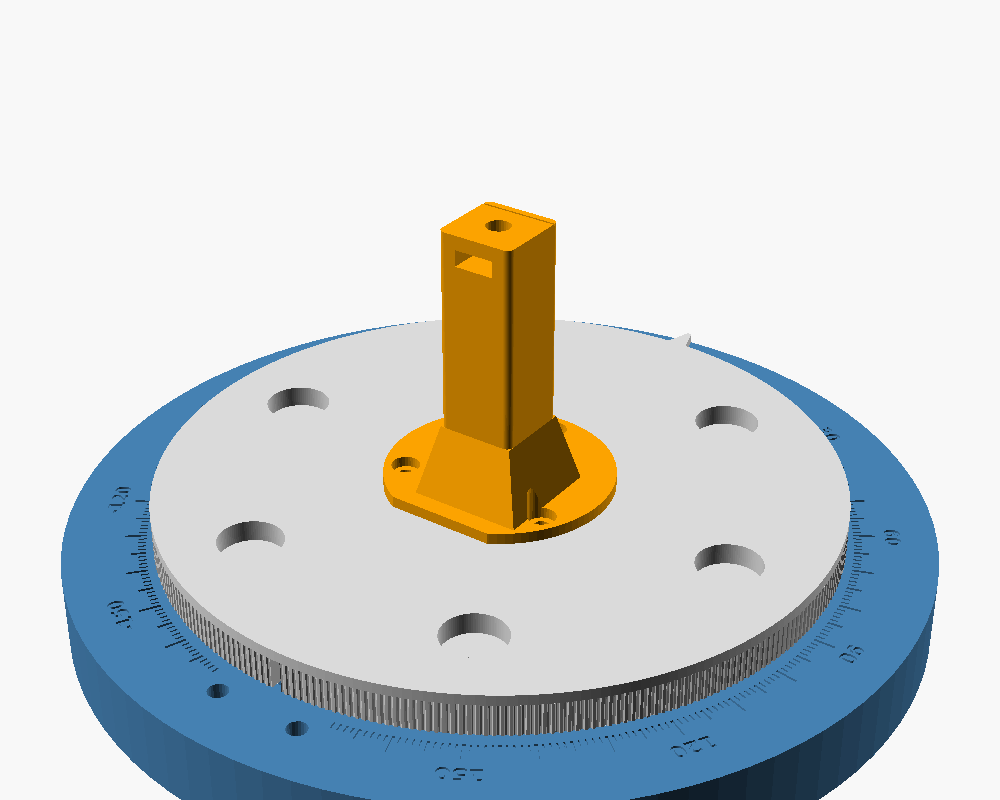

# Rotating stand (low-assembly)

A simpler version of [`../stand`](../stand): **5 printed parts and 6 screws,
about 5 minutes to assemble.** It has no bearings, BBs, spring plunger or
ballast. The platter turns plastic-on-plastic on a raised ring, and a printed
spring leaf clicks into a groove every 5°.



It keeps everything else from the original stand:

- the array phase center on the rotation axis;
- the engraved ±180° scale and pointer;
- the 300-tooth GT2 rim and rear insert holes, so a stepper can be added
  later.

## Parts

| STL | Print | Notes |
|---|---|---|
| `base.stl` | as-is | 240 mm Ø. 3 walls, 25% infill. More infill means more weight, which means less tip |
| `platter.stl` | **upside down**, so the post and skirt point up | 191 mm Ø. 0.12–0.16 mm layers keep the GT2 teeth crisp |
| `retainer.stl` | countersink down | |
| `mast.stl` | foot down | 5 walls, 40% infill. It carries the Phaser |
| `lock_wheel.stl` | nut pocket up | |

No supports. **Use PETG if you can:** the detent leaf flexes on every click,
and PLA fatigues sooner. PLA still works, but expect to reprint a base
eventually.

## Hardware (6 pieces)

| Item | Qty | Where |
|---|---|---|
| M5 × 16 countersunk (flat-head) screw | 1 | retainer → platter post |
| M4 × 12 screw | 3 | mast → platter |
| 1/4-20 × 3/4" hex bolt | 1 | stud the Phaser threads onto |
| 1/4-20 hex nut | 1 | pressed into the lock wheel |

The screws cut their own threads in the printed pilot holes, so no inserts
or tapping are needed. Optional extras: 12 mm stick-on feet, which have
recesses on the base underside, and a little dry PTFE lube on the ring.

## Assembly

1. Press the 1/4-20 nut into the lock wheel.
2. Lower the platter onto the base so the post drops through the center hole
   and the skirt drops into the channel.
3. Flip the stand over. Put the retainer on the post and drive the M5 screw
   in until it's snug, then back it off about a quarter turn so the platter
   spins freely.
4. Slide the 1/4-20 bolt head into the slot at the back of the mast top, then
   fix the mast into the platter pocket with the three M4 screws. The flat
   side of the foot sets its orientation.
5. Thread on the lock wheel, then the Phaser block. Square the board to the
   line engraved on the mast pad, and spin the wheel up to lock it.

## Things to check on the first unit

- **Fit:** the post should turn freely in the base with no wobble. If it
  binds or rattles, change `fit` (radial clearance, default 0.3 mm) and
  reprint the base only.
- **Detent feel:** if the clicks are too stiff or too soft, change
  `leaf_preload` (default 0.8 mm) and reprint the base.
- **Array offset:** `array_center_from_left` is still an assumption (see
  `../stand/README.md`). Only `mast.stl` depends on it.
- **Wiring:** route the cables with slack. There is no end stop, so stay
  within about ±180°.

## Re-exporting

```
cd hardware/stand-simple
for p in base platter retainer mast lock_wheel; do
  openscad -D "part=\"$p\"" -o stl/$p.stl phaser_stand_simple.scad
done
```
