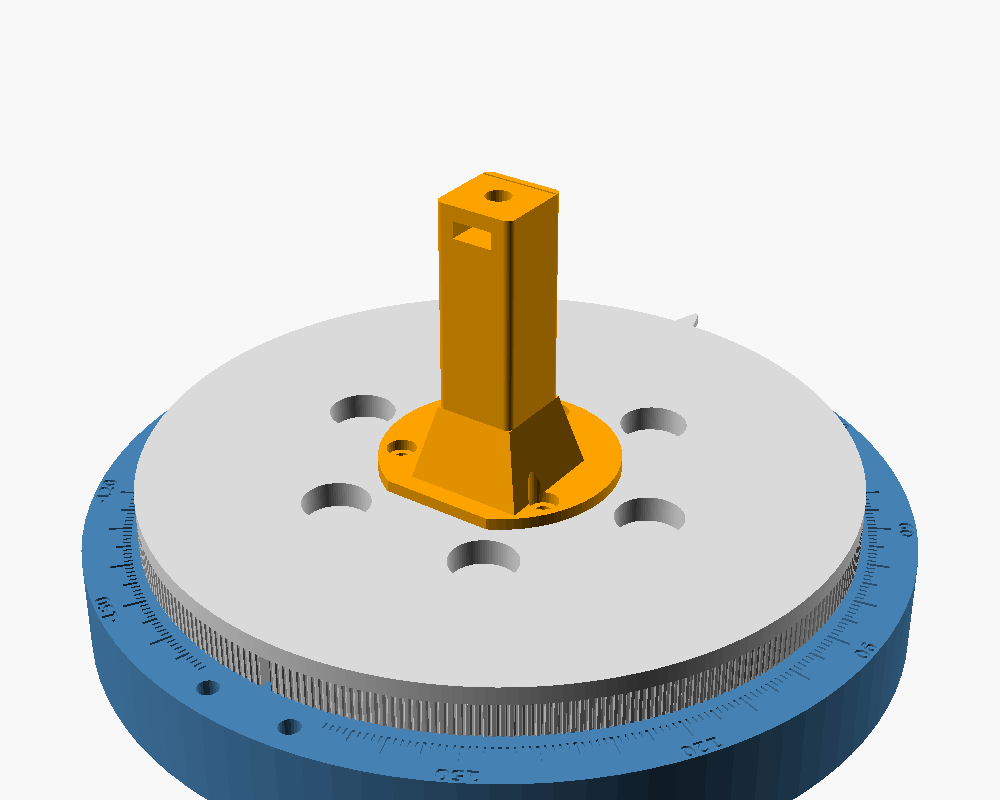

# Rotating stand

Manual azimuth turntable for the CN0566 Phaser: 5° detents, an engraved
±180° scale, and the array phase center placed on the rotation axis. It is
built for a motor later — GT2 teeth are molded into the platter rim and the
base has inserts for a stepper bracket — so adding one doesn't mean
reprinting.



Source: `phaser_stand.scad` (OpenSCAD, parametric). Ready-to-print STLs are
in `stl/`.

## Geometry

The Phaser's own 1/4-20 block (the black printed part the kit tripod screws
into) threads onto a stud at the top of the mast. The mast is offset so the
array center, not the thread, sits over the axis:

| Parameter | Value | Source |
|---|---|---|
| `board_w` | 113.19 mm | measured |
| `thread_from_left` | 52.28 mm | measured, patch face toward you |
| `thread_behind_board` | 6.0 mm | measured |
| `array_center_from_left` | 56.60 mm | **assumed** board center — verify |

To verify the last one, measure from the left PCB edge to the center of the
leftmost patch column and add 49.0 mm (3.5 × the 14 mm pitch). Then change
the value and re-export `mast.stl`. Only the mast depends on these numbers.

For far-field amplitude patterns a few millimeters of axis offset hardly
matters: it adds the same phase to every element. It matters more for
near-field tests and for phase-versus-angle work.

Angle convention: 0 is boresight (+Y), positive is clockwise seen from above.
Check this against the sign the software uses before trusting a measured
pattern's handedness.

## Parts

| STL | Qty | Print | Notes |
|---|---|---|---|
| `base.stl` | 1 | as-is, scale up | 220 mm Ø. 4 walls, 20% infill |
| `lid.stl` | 1 | as-is | 3 mm bottom plate; feet recesses face down |
| `platter.stl` | 1 | upside down (race up) | 191 mm Ø. 0.12–0.16 mm layers on the rim for the GT2 teeth |
| `mast.stl` | 1 | foot down | 5 walls, 40% infill — this carries the whole Phaser |
| `lock_wheel.stl` | 1 | nut pocket up | |

PETG or PLA. The race grooves print as overhangs; no supports needed at
0.2 mm layers.

## Hardware

| Item | Qty |
|---|---|
| 608 skate bearing (8 × 22 × 7) | 1 |
| 6 mm airsoft BBs (0.20 g, polished) | ~70 |
| M8 × 30 hex bolt, M8 washer, M8 nyloc | 1 each |
| M8 ball spring plunger, slotted, ~20 mm long | 1 |
| 1/4-20 × 5/8" hex bolt (the stud) | 1 |
| 1/4-20 hex nut (in the lock wheel) | 1 |
| M4 × 12 screws (mast to platter) | 3 |
| M3 × 10 countersunk screws (lid) | 4 |
| 12 mm stick-on rubber feet | 4 |
| Ballast: steel shot, sand, or washers | ~1 kg |
| *Motor later:* M4 heat-set inserts (5.6 × 6) | 2 |

## Assembly

1. **Base:** press the 608 up from underneath until it stops on the top lip.
   Fill the cavity with ballast, then screw the lid on.
2. **Detent:** thread the plunger up into the hole at +X, through the
   lid's access hole, until the ball sits about 1 mm above the base top.
3. **Race:** grease the base groove lightly and fill it with BBs.
4. **Platter:** drop the M8 bolt through the platter's center counterbore,
   lower the platter onto the balls, and add the washer and nyloc from below
   through the lid's center hole. Tighten until rotation has a little drag,
   then back off about 1/8 turn.
5. **Mast:** slide the 1/4-20 bolt head into the slot at the back of the
   mast top, then screw the mast into the platter pocket. The D-flat sets its
   orientation.
6. **Phaser:** thread the lock wheel onto the stud, nut side down, then
   thread the Phaser's block on. Square the board to the engraved line on the
   mast pad, then spin the lock wheel up to jam against the block.
7. **Detent tension:** set it with the plunger — screw it in for firmer
   clicks, back it out to turn freely.

Route the Pi's power and Ethernet cables with slack. The stand has no end
stop, so don't wind it more than about ±180°.

## Motor-ready (not yet built)

- The rim carries 300 GT2 teeth. With a 20T pulley that is 15:1, or 0.12°
  per full step on a 1.8° NEMA17.
- An open-ended 6 mm GT2 belt wraps the rim with both ends pinned in the
  rear slot. This limits travel to under one turn, which the cables do
  anyway.
- Two M4 insert holes on the base top at the rear (at ±7° from 180°, where
  the scale is left blank) are for a future bracket that holds the motor
  outside the base.

## Re-exporting

```
cd hardware/stand
for p in base lid platter mast lock_wheel; do
  openscad -D "part=\"$p\"" -o stl/$p.stl phaser_stand.scad
done
```

The base takes about 2 minutes because of the 360 engraved ticks.
